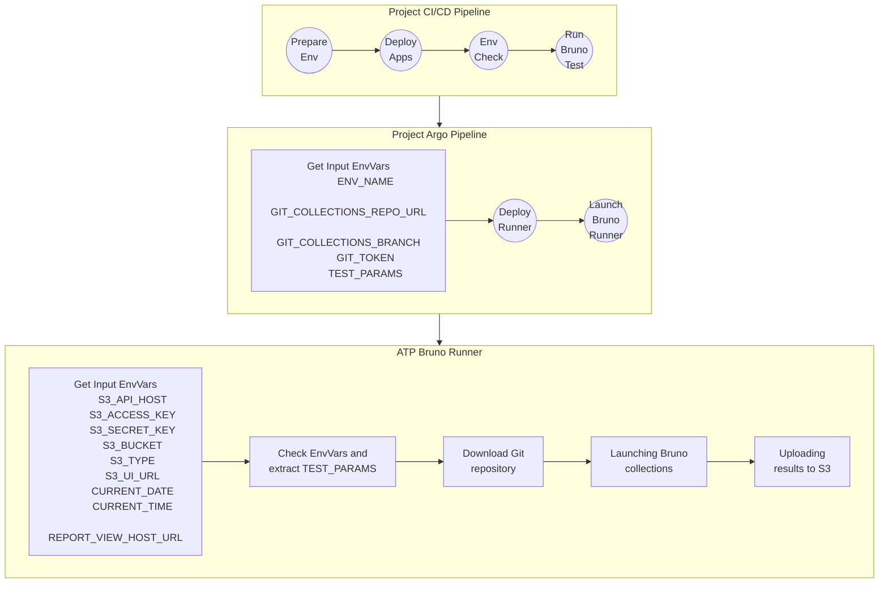

# Qubership Testing Platform Bruno Collections Runner

## Description of CI/CD process

### Main flow



### Variables description

#### Input for Project Argo Pipeline

- __ENVIRONMENT_NAME__ - Environment name
- __ATP_TESTS_GIT_REPO_URL__ - Git repository URL
- __ATP_TESTS_GIT_REPO_BRANCH__ - Branch to clone
- __ATP_TESTS_GIT_TOKEN__ - Git access token
- __TEST_PARAMS__ - JSON which contains parameters for collections execution. See `TEST_PARAMS example` and `TEST_PARAMS description` section

#### Input for ATP bruno Runner

- __ATP_STORAGE_SERVER_URL__ - MinIO API host
- __ATP_STORAGE_USERNAME__ - S3 access key
- __ATP_STORAGE_PASSWORD__ - S3 secret key
- __ATP_STORAGE_BUCKET__ - S3 bucket name
- __ATP_STORAGE_PROVIDER__ - Storage type (`aws` or `minio` or `s3`)
- __ATP_STORAGE_SERVER_UI_URL__ - S3 UI URL
- __CURRENT_DATE__ - Optional. Format `YYYY-MM-DD`, example: `2025-07-30`
- __CURRENT_TIME__ - Optional. Format `HH:MM:SS`, example `23:45:12`
- __ATP_REPORT_VIEW_UI_URL__ - URL of S3 Static viewer

#### TEST_PARAMS Example

```json
{
    "env_vars": {
        "DB_NAME_PREFIX": "db-12345",
        "KAFKA_PROJECT": "kafka_temp",
        "NAMESPACE": "systems_under_test",
        "SERVER_HOSTNAME": "project.cloud.somedomain.com",
        "SERVER_PORT": "6443",
        "cluster": ".k8s-apps5.k8s.sdntest.somedomain.com"
    },
    "env": "mockserver",
    "collections": [
        "collections/Project stubs",
        "collections/Project_collection"
    ],
    "flags": [
        "--insecure",
        "--iteration-count 1"
    ]
}
```

#### TEST_PARAMS description

The flags for launching Bruno tools are listed below.

- __collections__ - List of relative paths to files with collections. See flag `bru run {relative path to collection}`
- __env__ - Relative path to environment. See flag `--environment {name of the environment}`
- __env_vars__ - List of Environments variables. See flag `--env-var DB_NAME_PREFIX=db-ns515`
- __flags__ - Set of flag for execution. See flags `--insecure --iteration-count 1` and other

## Reporting

During the collection run, reports are generated in three formats: CLI, JSON, and Allure.

- CLI - Performs logging to the console. Required for local debugging of the service itself, as well as debugging of the collection.
- JSON - This is a built-in Bruno logger that writes results to a JSON file. It is convenient for automated parsing of results.
- Allure - A system for visually displaying the results of collection runs. Ideal for visual analysis of automated test results by humans.

## Local Build

This guide explains how to prepare your local machine to run the service and Bruno tests with reports.

## 1) Prerequisites
- **Node.js LTS** (includes `npm`). Check:
  ```bash
  node -v && npm -v
  ```
- **Git** (to use Git Bash / PowerShell).

## 2) Install CLI utilities: `jq` and `s5cmd`
Recommended on Windows: install via **Scoop**¹
```powershell
# Install Scoop (if not installed)¹
Set-ExecutionPolicy -Scope CurrentUser RemoteSigned
iwr -useb get.scoop.sh | iex

# Install jq and s5cmd
scoop install jq s5cmd
```

Alternatives:
```powershell
# Winget
winget install jqlang.jq
winget install peak.s5cmd

# Chocolatey
choco install jq
choco install s5cmd
```

Verify:
```bash
jq --version
s5cmd --version
```

> **Git Bash note:** if commands aren’t visible, add Scoop shims to PATH:

## 3) Install project dependencies
In the repository root:
```bash
npm install
```

## 4) Troubleshooting
- **`jq: command not found`** → install via Scoop/Winget/Choco; re-open terminal.
- **`s5cmd: command not found`** → ensure it’s installed and visible in PATH (see note above).

## Local Run Collections without S3 allure report (via `local_start.sh`)

Below are minimal steps to run Bruno collections locally via the prepared script.

### Pre-step: Prepare test data (REQUIRED)
Before running `local_start.sh`, you **must** prepare test data for conversion:
1. Create/modify file `tools/local_test_params.json` and fill it with test data
2. Download the collection(s) and environment(s) you need to run into the local-collection folder. The paths to the collections and environment(s) must match the contents of file `tools/local_test_params.json`
3. You need to create a new folder named local-collection in the root directory.
4. Add the folder containing the collection(s) and the environment for running to the local-collection folder (note: the environment must be located inside the folder with the collection in the `environments` subfolder (this is Bruno's condition))
5. The main file for running the collection at the end of the local_starts.sh file should be start_tests.sh

**Example content for `tools/local_test_params.json`:**
```json
{
  "collections": [
    "collections/Claro stubs"
  ],
  "env": "mockserver",
  "env_vars": {
    "SERVER_HOSTNAME": "http://localhost",
    "SERVER_PORT": "3001",
    "token": "some-token",
    "tenant-id": "some-tenant-id",
    "MOCKSERVER": "https://mockserver-project-name.atp.managed.somedomain.cloud",
    "PUBLIC_GATEWAY": "http://public-gateway-dev01.project-info.managed.somedomain.cloud",
    "productId": "42",
    "PUBLIC_GATEWAY_QA": "https://public-gateway-qa1.project-info.managed.somedomain.cloud"
  },
  "flags": [
    "--insecure"
  ]
}
```

## Local Run Collections with S3 allure report (via `local_start.sh`)

Below are minimal steps to run Bruno collections locally via the prepared script.

### Pre-step: Prepare test data (REQUIRED)
Before running `local_start.sh`, you **must** prepare test data for conversion:
1. Create/modify file `tools/local_test_params.json` and fill it with test data
2. Download the collection(s) and environment(s) you need to run into the local-collection folder. The paths to the collections and environment(s) must match the contents of file `tools/local_test_params.json`
3. You must fill in the values for the environment variables.
4. You need to add a “.” symbol to each absolute path in the entrypoint.sh file and start_tests.sh (for example, to declare the contents of the scripts and tools folders).
5. You need to add a command to navigate to the working directory (cd $WORK_DIR) before copying the start_tests.sh file to entrypoint.sh
6. The main file for running the collection at the end of the local_starts.sh file should be entrypoint.sh

**Example of the contents of file `tools/local_test_params.json` is shown in the previous section.**


### Quick Start
```bash
# from repo root

# Prepare test data
#    - create ./tools/local_test_params.json with project/job data (see example above)
# Then run
./local_start.sh
```
