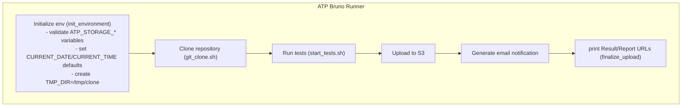

# Bruno Collections Runner
- [Overview](#overview)
- [Atlas-atp3-pipeline Run](#atlas-atp3-pipeline-run)
- [Manual run](#manual-run)
- [Deploy parameters](#deploy-parameters)
- [Hardware / Resource Requirements (HWE)](#hardware--resource-requirements-hwe)
- [Description of CI/CD process](#description-of-cicd-process)
  - [Main flow](#main-flow)
  - [TEST_PARAMS description](#test_params-description)
  - [TEST_PARAMS Example](#test_params-example)
- [Reporting](#reporting)
- [Local Build](#local-build)
  - [1) Prerequisites](#1-prerequisites)
  - [2) Install CLI utilities: `jq` and `s5cmd`](#2-install-cli-utilities-jq-and-s5cmd)
  - [3) Install project dependencies](#3-install-project-dependencies)
  - [4) Troubleshooting](#4-troubleshooting)
- [Local Run Collections without S3 allure report (via `local_start.sh`)](#local-run-collections-without-s3-allure-report-via-local_startsh)
  - [Pre-step: Prepare test data (REQUIRED)](#pre-step-prepare-test-data-required)
- [Local Run Collections with S3 allure report (via `local_start.sh`)](#local-run-collections-with-s3-allure-report-via-local_startsh)
  - [Pre-step: Prepare test data (REQUIRED)](#pre-step-prepare-test-data-required-1)
  - [Quick Start](#quick-start)


## Overview 

Bruno Runner - this runner uses .bru test cases and mainly used for `North Bound Integration testing`. 
Separate calls can be combined into a collection.

## Atlas-atp3-pipeline Run

> Comparing to other runners CUSTOM_PARAMS is different please double-check it before run

One option is to run tests using Atlas-atp3-pipeline

### Atlas-atp3-pipeline Deploy Parameters

When running it's implicitly uses all [Deploy parameters](#deploy-parameters) it stored in DB.

| Parameter | Type | Mandatory | Default value                                                                                                                 | Description |
|-----------|------|-----------|-------------------------------------------------------------------------------------------------------------------------------|-------------|
| PIPELINE_RUNTIME_CONFIG | string | yes | `environments/<project-env>.yaml`                                                                                             | Environment Configuration file |
| ATP_APPLICATION_VERSION | string | yes | `atp3-bruno-runner:master-20251216.081318-9-RELEASE`                                                                          | Bruno descriptor of image to run |
| ATP_TESTS_GIT_REPO_URL | string | yes | `https://<somegit>.com/<path-to-tests>.git`                                                                                   | URL to a repository with test files | 
| ATP_TESTS_GIT_REPO_BRANCH | string | yes | `master`                                                                                                                      | Branch from which need to execute tests mentioned in ATP_TESTS_GIT_REPO_URL |
| EXECUTION_TYPE | string | no | `scope`                                                                                                                       | Type of execution (For Bruno use TEST_PARAMS) |
| EXECUTION_NAME | string | no | `product`                                                                                                                     | Name of execution (For Bruno use TEST_PARAMS) |
| ENABLE_JIRA_INTEGRATION | string | yes | `false`                                                                                                                       | Activates Jira Integration |
| NOTIFICATION_RECIPIENTS | string | yes | `someEmail@no-reply.com`                                                                                                      | Emails of test result recipients |
| CUSTOM_PARAMS | string | yes | `TEST_PARAMS='{"collections":["collections/Project_collection"],"env":"env1","env_vars":{"VAR":""},"flags":["--insecure"]}';` | It's IMPORTANT to set TEST_PARAMS for Bruno test run because it's not propagated automatically as in other runners. [Another example](#test_params-example) |

## Manual run

If you want to use custom runners or local run here is a list of parameters

> Atlas Runner implicitly uses these parameters

## Deploy parameters

| Parameter | Type | Mandatory | Default value | Description                                                                               |
|-----------|------|-----------|---------------|-------------------------------------------------------------------------------------------|
| ENVIRONMENT_NAME | string | **yes** | `default` | Environment name (e.g., dev, test, prod).                                                 |
| ATP_TESTS_GIT_REPO_URL | string | **yes** | `""` | Git repository URL with test sources. https://<somegit>.com/<project>/<project>-tests.git |
| ATP_TESTS_GIT_TOKEN | string | **yes** | `your-token` | Access token for private Git repositories with tests (propagated automatically).          |
| TEST_PARAMS | json | **yes** | `{}` | Additional test parameters to pass to test runner.                                        |
| ATP_STORAGE_BUCKET | string | **yes** | `""` | S3 bucket name for uploading results.                                                     |
| ATP_STORAGE_USERNAME | string | **yes** | `storage-access-key` | Access key for S3 bucket.                                                                 |
| ATP_STORAGE_PASSWORD | string | **yes** | `storage-secret-key` | Secret key for S3 bucket.                                                                 |
| ATP_STORAGE_SERVER_URL | string | **yes** | `` | API endpoint for accessing S3 storage.                                                    |
| ATP_STORAGE_SERVER_UI_URL | string | **yes** | `` | Web UI endpoint for viewing files in the S3 bucket.                                       |
| ATP_REPORT_VIEW_UI_URL | string | **yes** | `""` | URL for viewing generated test reports.                                                   |
| ATP_TESTS_GIT_REPO_BRANCH | string | no | `master` | Git branch containing tests.                                                              |
| ATP_ENVGENE_CONFIGURATION | json | no | `{}` | Additional test parameters to pass to test runner from EnvGene.                           |
| ATP_STORAGE_PROVIDER | string | no | `minio` | Type of S3 storage (e.g., minio, aws).                                                    |
| ATP_STORAGE_REGION | string | no | `""` | S3 region (used by some providers).                                                       |
| CURRENT_DATE | string | no | `""` | Date to use in report naming (format: YYYY-MM-DD).                                        |
| CURRENT_TIME | string | no | `""` | Time to use in report naming (format: HH:MM:SS).                                          |
| ATP_RUNNER_JOB_TTL | integer | no | `3600` | Time-to-live for the test job in seconds.                                                 |
| ATP_RUNNER_JOB_EXIT_STRATEGY | string | no | `EXIT_ALWAYS` | Exit strategy for the runner job.                                                         |
| ENABLE_JIRA_INTEGRATION | boolean | no | `false` | Enable Jira integration for tests.                                                        |
| MONITORING_ENABLED | boolean | no | `true` | Enable monitoring for the runner.                                                         |
| SECURITY_CONTEXT_ENABLED | boolean | no | `false` | Flag to enable or disable the security context for the Playwright Runner service.         |
| podSecurityContext | object | no | `{ runAsUser: 1000, fsGroup: 1000 }` | Pod-level security context settings.                                                      |
| containerSecurityContext | object | no | `{}` | Container-level security context settings.                                                |
| affinity | object | no | `{}` | Pod affinity rules.                                                                       |
| tolerations | array | no | `[]` | Pod tolerations.                                                                          |

## Hardware / Resource Requirements (HWE)

Supported 2 profiles: `dev`, `prod`.

| Parameter        | Dev    | Prod   |
|------------------|--------|--------|
| MEMORY_REQUEST   | 100Mi  | 100Mi  |
| MEMORY_LIMIT     | 1000Mi | 2000Mi |
| CPU_REQUEST      | 100m   | 300m   |
| CPU_LIMIT        | 500m   | 1000m  |


## Description of CI/CD process

### Main flow


```mermaid
flowchart TD
    subgraph atp_bruno_runner["ATP Bruno Runner"]
        direction LR
        runner_step1["Initialize env (init_environment)
            - validate ATP_STORAGE_* variables
            - set CURRENT_DATE/CURRENT_TIME defaults
            - create TMP_DIR=/tmp/clone
        "] -->
        runner_step2["Clone repository (git_clone.sh)"] -->
        runner_step3["Run tests (start_tests.sh)"] -->
        runner_step4["Upload to S3"] -->
        runner_step5["Generate email notification"] -->
        runner_step6["print Result/Report URLs (finalize_upload)"]
    end
```
#### TEST_PARAMS description

For Bruno runner it's required to set TEST_PARAMS inside CUSTOM_PARAMS. 
`TEST_PARAMS` is a JSON object with the following supported keys:

| Parameter | Type | Mandatory | Default value | Description |
|-----------|------|-----------|---------------|-------------|
| collections | array[string] | yes | `[]` | List of **relative paths** to Bruno collection directories that will be executed (each entry is used as `bru run <collection>`). |
| env | string | yes | `""` | Bruno environment name/path passed to `bru run --env "<env>"`. If the value ends with `.bru`, the runner strips the extension. |
| env_vars | object | no | `{}` | Environment variables passed to Bruno as `--env-var key=value` (one per entry). |
| flags | array[string] | no | `[]` | Extra Bruno CLI flags. The runner joins the array with spaces (example: `["--insecure","--iteration-count 1"]` → `--insecure --iteration-count 1`). |

Use collection to set path to test collection. You can use several collections separated with `,`
Use env to set environment file which is in environment folder inside collection

##### TEST_PARAMS Example

```json
{
    "env_vars": {
        "DB_NAME_PREFIX": "db-12345",
        "KAFKA_PROJECT": "kafka_temp",
        "NAMESPACE": "systems_under_test",
        "SERVER_HOSTNAME": "project.cloud.somedomain.com",
        "SERVER_PORT": "6443",
        "cluster": ".k8s-apps5.k8s.sdntest.somedomain.com"
    },
    "env": "mockserver",
    "collections": [
        "collections/Project stubs",
        "collections/Project_collection"
    ],
    "flags": [
        "--insecure",
        "--iteration-count 1"
    ]
}
```
The same example appropriate for atlas-atp3-runner:
```
TEST_PARAMS='{"env_vars":{"DB_NAME_PREFIX":"db-12345","KAFKA_PROJECT":"kafka_temp","NAMESPACE":"systems_under_test","SERVER_HOSTNAME":"project.cloud.somedomain.com","SERVER_PORT":"6443","cluster":".k8s-apps5.k8s.sdntest.somedomain.com"},"env":"mockserver","collections":["collections/test","collections/Project_collection"],"flags":["--insecure","--iteration-count 1"]};'
```

## Reporting

During the collection run, reports are generated in three formats: CLI, JSON, and Allure.

- CLI - Performs logging to the console. Required for local debugging of the service itself, as well as debugging of the collection.
- JSON - This is a built-in Bruno logger that writes results to a JSON file. It is convenient for automated parsing of results.
- Allure - A system for visually displaying the results of collection runs. Ideal for visual analysis of automated test results by humans.

## Local Build

This guide explains how to prepare your local machine to run the service and Bruno tests with reports.

## 1) Prerequisites
- **Node.js LTS** (includes `npm`). Check:
  ```bash
  node -v && npm -v
  ```
- **Git** (to use Git Bash / PowerShell).

## 2) Install CLI utilities: `jq` and `s5cmd`
Recommended on Windows: install via **Scoop**¹
```powershell
# Install Scoop (if not installed)¹
Set-ExecutionPolicy -Scope CurrentUser RemoteSigned
iwr -useb get.scoop.sh | iex

# Install jq and s5cmd
scoop install jq s5cmd
```

Alternatives:
```powershell
# Winget
winget install jqlang.jq
winget install peak.s5cmd

# Chocolatey
choco install jq
choco install s5cmd
```

Verify:
```bash
jq --version
s5cmd --version
```

> **Git Bash note:** if commands aren’t visible, add Scoop shims to PATH:

## 3) Install project dependencies
In the repository root:
```bash
npm install
```

## 4) Troubleshooting
- **`jq: command not found`** → install via Scoop/Winget/Choco; re-open terminal.
- **`s5cmd: command not found`** → ensure it’s installed and visible in PATH (see note above).

## Local Run Collections without S3 allure report (via `local_start.sh`)

Below are minimal steps to run Bruno collections locally via the prepared script.

### Pre-step: Prepare test data (REQUIRED)
Before running `local_start.sh`, you **must** prepare test data for conversion:
1. Create/modify file `tools/local_test_params.json` and fill it with test data
2. Download the collection(s) and environment(s) you need to run into the local-collection folder. The paths to the collections and environment(s) must match the contents of file `tools/local_test_params.json`
3. You need to create a new folder named local-collection in the root directory.
4. Add the folder containing the collection(s) and the environment for running to the local-collection folder (note: the environment must be located inside the folder with the collection in the `environments` subfolder (this is Bruno's condition))
5. The main file for running the collection at the end of the local_starts.sh file should be start_tests.sh

**Example content for `tools/local_test_params.json`:**
```json
{
  "collections": [
    "collections/Claro stubs"
  ],
  "env": "mockserver",
  "env_vars": {
    "SERVER_HOSTNAME": "http://localhost",
    "SERVER_PORT": "3001",
    "token": "some-token",
    "tenant-id": "some-tenant-id",
    "MOCKSERVER": "https://mockserver-project-name.atp.managed.somedomain.cloud",
    "PUBLIC_GATEWAY": "http://public-gateway-dev01.project-info.managed.somedomain.cloud",
    "productId": "42",
    "PUBLIC_GATEWAY_QA": "https://public-gateway-qa1.project-info.managed.somedomain.cloud"
  },
  "flags": [
    "--insecure"
  ]
}
```

## Local Run Collections with S3 allure report (via `local_start.sh`)

Below are minimal steps to run Bruno collections locally via the prepared script.

### Pre-step: Prepare test data (REQUIRED)
Before running `local_start.sh`, you **must** prepare test data for conversion:
1. Create/modify file `tools/local_test_params.json` and fill it with test data
2. Download the collection(s) and environment(s) you need to run into the local-collection folder. The paths to the collections and environment(s) must match the contents of file `tools/local_test_params.json`
3. You must fill in the values for the environment variables.
4. You need to add a “.” symbol to each absolute path in the entrypoint.sh file and start_tests.sh (for example, to declare the contents of the scripts and tools folders).
5. You need to add a command to navigate to the working directory (cd $WORK_DIR) before copying the start_tests.sh file to entrypoint.sh
6. The main file for running the collection at the end of the local_starts.sh file should be entrypoint.sh

**Example of the contents of file `tools/local_test_params.json` is shown in the previous section.**


### Quick Start
```bash
# from repo root

# Prepare test data
#    - create ./tools/local_test_params.json with project/job data (see example above)
# Then run
./local_start.sh
```
