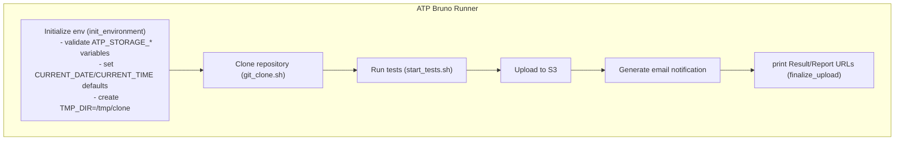

# Bruno Collections Runner

## Table of Contents

- [Overview](#overview)
- [Atlas-atp3-pipeline Run](#atlas-atp3-pipeline-run)
- [Manual Run](#manual-run)
- [Deploy Parameters](#deploy-parameters)
- [Hardware / Resource Requirements (HWE)](#hardware--resource-requirements-hwe)
- [How to Set Global Environment File](#how-to-set-global-environment-file)
- [Description of CI/CD Process](#description-of-cicd-process)
  - [Main Flow](#main-flow)
- [Reporting](#reporting)
- [Bruno V4 migration](#bruno-v4-migration)
- [Local Build](#local-build)
  - [1. Prerequisites](#1-prerequisites)
  - [2. Install CLI Utilities: `jq` and `s5cmd`](#2-install-cli-utilities-jq-and-s5cmd)
  - [3. Install Project Dependencies](#3-install-project-dependencies)
  - [4. Troubleshooting](#4-troubleshooting)
- [Local Run Collections Without S3 Allure Report (via `local_start.sh`)](#local-run-collections-without-s3-allure-report-via-local_startsh)
  - [Pre-step: Prepare Test Data (REQUIRED)](#pre-step-prepare-test-data-required)
- [Local Run Collections With S3 Allure Report (via `local_start.sh`)](#local-run-collections-with-s3-allure-report-via-local_startsh)
  - [Pre-step: Prepare Test Data (REQUIRED)](#pre-step-prepare-test-data-required-with-s3)
  - [Quick Start](#quick-start)


## Overview

Bruno Runner - this runner uses .bru test cases and mainly used for `North Bound Integration testing`.
Separate calls can be combined into a collection.

## Atlas-atp3-pipeline Run

> Comparing to other runners CUSTOM_PARAMS is different please double-check it before run

One option is to run tests using Atlas-atp3-pipeline

### Atlas-atp3-pipeline Deploy Parameters

When running it's implicitly uses all [Deploy parameters](#deploy-parameters) it stored in DB.

| Parameter                 | Type   | Mandatory | Default value                                        | Description                                                                  |
|---------------------------|--------|-----------|------------------------------------------------------|------------------------------------------------------------------------------|
| PIPELINE_RUNTIME_CONFIG   | string | yes       | `environments/<project-env>.yaml`                    | Environment Configuration file                                               |
| ATP_APPLICATION_VERSION   | string | yes       | `atp3-bruno-runner:master-20251216.081318-9-RELEASE` | Bruno descriptor of image to run                                             |
| ATP_TESTS_GIT_REPO_URL    | string | yes       | `https://<somegit>.com/<path-to-tests>.git`          | URL to a repository with test files                                          |
| ATP_TESTS_GIT_REPO_BRANCH | string | yes       | `master`                                             | Branch from which need to execute tests mentioned in ATP_TESTS_GIT_REPO_URL  |
| EXECUTION_TYPE            | string | no        | `scope`                                              | Type of execution (For Bruno use collection)                                 |
| EXECUTION_NAME            | string | no        | `product`                                            | Name of execution                                                            |
| ENABLE_JIRA_INTEGRATION   | string | yes       | `false`                                              | Activates Jira Integration                                                   |
| NOTIFICATION_RECIPIENTS   | string | yes       | `someEmail@no-reply.com`                             | Emails of test result recipients                                             |
| EXTRA_VARS                | string | no        | `""`                                                 | Additional environment variables to be injected into the runner environment. |
| podSecurityContext                  | object  | no        | `{ runAsUser: 1000, fsGroup: 1000 }`      | Kubernetes pod-level security context for the runner Job. Applied when `SECURITY_CONTEXT_ENABLED=true`. Sets UID/GID for pod processes and volume file ownership.                                                                                            |
| TRIGGER_AUTHOR                      | string  | no        | `""`                                      | Optional technical parameter. Used to display the test run author in the report.                                                                                                                                                                             |

## Manual run

If you want to use custom runners or local run here is a list of parameters

> Atlas Runner implicitly uses these parameters

## Deploy parameters

| Parameter                           | Type    | Mandatory | Default value                             | Description                                                                                                                                                             |
|-------------------------------------|---------|-----------|-------------------------------------------|-------------------------------------------------------------------------------------------------------------------------------------------------------------------------|
| ENVIRONMENT_NAME                    | string  | **yes**   | `default`                                 | Environment name (e.g., dev, test, prod).                                                                                                                               |
| ENV_CONFIGURATION_TEMPLATE_FILENAME | string  | no        | `environment-configuration-template.json` | Environment configuration template filename used during runtime configuration rendering.                                                                                |
| ATP_TESTS_GIT_REPO_URL              | string  | **yes**   | `""`                                      | Git repository URL with test sources. https://<somegit>.com/<project>/<project>-tests.git                                                                               |
| ATP_TESTS_GIT_TOKEN                 | string  | **yes**   | `your-token`                              | Access token for private Git repositories with tests (propagated automatically).                                                                                        |
| TEST_PARAMS                         | JSON    | **yes**   | `{}`                                      | Test parameters with information about test suite.                                                                                                                      |
| BRUNO_ENV                           | string  | no        | `""`                                      | Name of Bruno environment to use (e.g., envoriment-template.bru).                                                                                                       |
| BRUNO_FLAGS                         | string  | no        | `--insecure`                              | Extra flags to pass to the Bruno CLI when running collections. For example, `--insecure --r`.                                                                           |
| BRUNO_FOLDERS                       | string  | no        | ``                                        | Pipe-separated list of folders inside the `collections/` directory. If set, only these collections will be run.<br>Example: `BRUNO_FOLDERS="collectionA\|collectionB"`. |
| BRUNO_GLOBAL_ENV                   | string  | no        | `""`                                      | Name of Bruno global environment file stored in the environments directory. For usage, see [How to set Global environment file](#how-to-set-global-environment-file). |
| BRUNO_WORKSPACE_PATH                | string  | no        | `""`                                      | Workspace path for Bruno runner. For usage, see [How to set Global environment file](#how-to-set-global-environment-file). |
| ATP_ENVGENE_CONFIGURATION           | JSON    | no        | `{}`                                      | Additional test parameters (Systems) to pass to test runner from EnvGene.                                                                                               |
| ATP_STORAGE_BUCKET                  | string  | **yes**   | `""`                                      | S3 bucket name for uploading results.                                                                                                                                   |
| ATP_STORAGE_USERNAME                | string  | **yes**   | `storage-access-key`                      | Access key for S3 bucket.                                                                                                                                               |
| ATP_STORAGE_PASSWORD                | string  | **yes**   | `storage-secret-key`                      | Secret key for S3 bucket.                                                                                                                                               |
| ATP_STORAGE_SERVER_URL              | string  | **yes**   | ``                                        | API endpoint for accessing S3 storage.                                                                                                                                  |
| ATP_STORAGE_SERVER_UI_URL           | string  | **yes**   | ``                                        | Web UI endpoint for viewing files in the S3 bucket.                                                                                                                     |
| ATP_REPORT_VIEW_UI_URL              | string  | **yes**   | `""`                                      | URL for viewing generated test reports.                                                                                                                                 |
| ATP_TESTS_GIT_REPO_BRANCH           | string  | no        | `master`                                  | Git branch containing tests.                                                                                                                                            |
| ATP_ENVGENE_CONFIGURATION           | JSON    | no        | `{}`                                      | Additional test parameters to pass to test runner from EnvGene.                                                                                                         |
| ATP_STORAGE_PROVIDER                | string  | no        | `minio`                                   | Type of S3 storage (e.g., minio, aws).                                                                                                                                  |
| ATP_STORAGE_REGION                  | string  | no        | `""`                                      | S3 region (used by some providers).                                                                                                                                     |
| DEBUG_MODE                          | boolean | no        | `false`                                   | Enable additional debug behavior and logs in runner scripts.                                                                                                            |
| CURRENT_DATE                        | string  | no        | `""`                                      | Date to use in report naming (format: YYYY-MM-DD).                                                                                                                      |
| CURRENT_TIME                        | string  | no        | `""`                                      | Time to use in report naming (format: HH:MM:SS).                                                                                                                        |
| ATP_RUNNER_JOB_TTL                  | integer | no        | `3600`                                    | Time-to-live for the test job in seconds.                                                                                                                               |
| ATP_RUNNER_JOB_EXIT_STRATEGY        | string  | no        | `EXIT_ALWAYS`                             | Exit strategy for the runner job.                                                                                                                                       |
| ENABLE_JIRA_INTEGRATION             | boolean | no        | `false`                                   | Enable Jira integration for tests.                                                                                                                                      |
| MONITORING_ENABLED                  | boolean | no        | `true`                                    | Enable monitoring for the runner.                                                                                                                                       |
| SECURITY_CONTEXT_ENABLED            | boolean | no        | `false`                                   | Flag to enable or disable the security context for the Playwright Runner service.                                                                                       |
| podSecurityContext                  | object  | no        | `{ runAsUser: 1000, fsGroup: 1000 }`      | Pod-level security context settings.                                                                                                                                    |
| containerSecurityContext            | object  | no        | `{}`                                      | Container-level security context settings.                                                                                                                              |
| affinity                            | object  | no        | `{}`                                      | Pod affinity rules.                                                                                                                                                     |
| tolerations                         | array   | no        | `[]`                                      | Pod tolerations.                                                                                                                                                        |

## Hardware / Resource Requirements (HWE)

Supported 2 profiles: `dev`, `prod`.

| Parameter        | Dev    | Prod   |
|------------------|--------|--------|
| MEMORY_REQUEST   | 100Mi  | 100Mi  |
| MEMORY_LIMIT     | 1000Mi | 2000Mi |
| CPU_REQUEST      | 100m   | 300m   |
| CPU_LIMIT        | 500m   | 1000m  |

## How to set Global environment file

### BRUNO_GLOBAL_ENV

> TO USE THIS FEATURE PLEASE ADD workspace.yml file to your repository (more details and an example is below)

Specifies the name of a Bruno global environment file (e.g., `debug`) to use when running collections. The environment file should exist in the `environments/` directory within your Bruno workspace.

**Usage:**

- Set the environment variable in EXTRA_VARS
  `BRUNO_GLOBAL_ENV=debug`

- The specified file `debug.yml` must be located under `environments/` inside your workspace path.
- You may combine `BRUNO_GLOBAL_ENV` with `BRUNO_WORKSPACE_PATH` if your environments directory is not in the root folder.

**Example:**

Suppose your project structure is:

```text
<repository-name>/
├── collections/
├── environments/
│   ├── default.yml
│   └── debug.yml
└── workspace.yml
```

To use `debug.bru` (which defines global variables or settings for your collections):

**Note:**
- You do not need to specify the file extension `.yml`
- If not set, the runner will skip adding a global environment.

For more about global environments in Bruno: see the [Bruno documentation](https://docs.usebruno.com/variables/global-environment-variables)

### BRUNO_WORKSPACE_PATH

This environment variable specifies the path to your Bruno workspace directory. The workspace directory must contain your `workspace.yml`, as well as your `collections/` and `environments/` directories. Use this variable when the default workspace location (usually the root of the repository) does not match where your Bruno project files are stored.

**How to use:**
- Set `BRUNO_WORKSPACE_PATH` to the relative or absolute path of the folder containing your `workspace.yml` and `collections/`.
- For example, if your directory structure is:
  ```text
  <repository-name>/
  ├── subdir/
  │   ├── workspace.yml
  │   ├── collections/
  │   └── environments/
  ```
  Set `BRUNO_WORKSPACE_PATH=../..` or `BRUNO_WORKSPACE_PATH=subdir`
- This allows the runner to locate your workspace and environments correctly regardless of where they are in your repository.

> If you do not set `BRUNO_WORKSPACE_PATH`, the runner will assume the workspace is in the root directory by default.

**Common use-cases:**
- Monorepos or projects with nested structures.
- Working with multiple Bruno projects in a single repository.
- Custom layouts for project organization.

**Troubleshooting Tips:**
- Ensure `workspace.yml` and `collections/` and `environments/` live inside the directory you specify.
- If you see errors about missing workspace or collection files, double-check your path and directory structure.

## Description of CI/CD process

### Main flow


```mermaid
flowchart TD
    subgraph atp_bruno_runner["ATP Bruno Runner"]
        direction LR
        runner_step1["Initialize env (init_environment)
            - validate ATP_STORAGE_* variables
            - set CURRENT_DATE/CURRENT_TIME defaults
            - create TMP_DIR=/tmp/clone
        "] -->
        runner_step2["Clone repository (git_clone.sh)"] -->
        runner_step3["Run tests (start_tests.sh)"] -->
        runner_step4["Upload to S3"] -->
        runner_step5["Generate email notification"] -->
        runner_step6["print Result/Report URLs (finalize_upload)"]
    end
```


## Reporting

During the collection run, reports are generated in three formats: CLI, JSON, and Allure.

- CLI - Performs logging to the console. Required for local debugging of the service itself, as well as debugging of the collection.
- JSON - This is a built-in Bruno logger that writes results to a JSON file. It is convenient for automated parsing of results.
- Allure - A system for visually displaying the results of collection runs. Ideal for visual analysis of automated test results by humans.

## Bruno V4 migration

This runner uses `@usebruno/cli` 4.0.0 and continues to run collections with `--env` and `--reporter-json`; it does not consume Bruno JUnit output.

Before moving a collection repository to Bruno V4:

1. Coordinate the desktop/client upgrade across the team. V4 descriptions, typed variables, migrated secrets, and YAML WebSocket multi-message requests can be incompatible with older clients.
2. If the collection uses a root `secrets.json`, open it in the Bruno V4 desktop app. The app moves its configuration into the selected environment's `externalSecrets` section; the CLI does not perform this migration. Continue passing the environment through `BRUNO_ENV`.
3. Audit scripts using `bru.setEnvVar`, `bru.deleteEnvVar`, and `bru.setGlobalEnvVar`. V4 persists these changes to disk. Replace operations handling credentials, tokens, or API keys with `bru.setVar` / `bru.deleteVar` so the values remain in memory.
4. Replace deprecated `{{$secrets.name.key}}` references with `{{name.key}}` within Bruno's three-month compatibility window.

The V4 JUnit `classname` change does not affect this runner: it parses Bruno JSON and emits Allure results. See [BRUNO-V4-IMPACT.md](BRUNO-V4-IMPACT.md) for the complete compatibility reference.

## Local Build

This guide explains how to prepare your local machine to run the service and Bruno tests with reports.

## 1) Prerequisites
- **Node.js LTS** (includes `npm`). Check:
  ```bash
  node -v && npm -v
  ```
- **Git** (to use Git Bash / PowerShell).

## 2) Install CLI utilities: `jq` and `s5cmd`
Recommended on Windows: install via **Scoop**¹
```powershell
# Install Scoop (if not installed)¹
Set-ExecutionPolicy -Scope CurrentUser RemoteSigned
iwr -useb get.scoop.sh | iex

# Install jq and s5cmd
scoop install jq s5cmd
```

Alternatives:
```powershell
# Winget
winget install jqlang.jq
winget install peak.s5cmd

# Chocolatey
choco install jq
choco install s5cmd
```

Verify:
```bash
jq --version
s5cmd --version
```

> **Git Bash note:** if commands aren’t visible, add Scoop shims to PATH:

## 3) Install project dependencies
In the repository root:
```bash
npm install
```

## 4) Troubleshooting
- **`jq: command not found`** → install via Scoop/Winget/Choco; re-open terminal.
- **`s5cmd: command not found`** → ensure it’s installed and visible in PATH (see note above).

## Local Run Collections without S3 allure report (via `local_start.sh`)

Below are minimal steps to run Bruno collections locally via the prepared script.

### Pre-step: Prepare test data (REQUIRED)
Before running `local_start.sh`, you **must** prepare test data for conversion:
1. Create/modify file `tools/local_test_params.json` and fill it with test data
2. Download the collection(s) and environment(s) you need to run into the local-collection folder. The paths to the collections and environment(s) must match the contents of file `tools/local_test_params.json`
3. You need to create a new folder named local-collection in the root directory.
4. Add the folder containing the collection(s) and the environment for running to the local-collection folder (note: the environment must be located inside the folder with the collection in the `environments` subfolder (this is Bruno's condition))
5. The main file for running the collection at the end of the local_starts.sh file should be start_tests.sh

**Example content for `tools/local_test_params.json`:**
```json
{
  "collections": [
    "collections/Claro stubs"
  ],
  "env": "mockserver",
  "env_vars": {
    "SERVER_HOSTNAME": "http://localhost",
    "SERVER_PORT": "3001",
    "token": "some-token",
    "tenant-id": "some-tenant-id",
    "MOCKSERVER": "https://mockserver-project-name.atp.managed.somedomain.cloud",
    "PUBLIC_GATEWAY": "http://public-gateway-dev01.project-info.managed.somedomain.cloud",
    "productId": "42",
    "PUBLIC_GATEWAY_QA": "https://public-gateway-qa1.project-info.managed.somedomain.cloud"
  },
  "flags": [
    "--insecure"
  ]
}
```

## Local Run Collections with S3 allure report (via `local_start.sh`)

Below are minimal steps to run Bruno collections locally via the prepared script.

### Pre-step: Prepare test data (REQUIRED) with S3
Before running `local_start.sh`, you **must** prepare test data for conversion:
1. Create/modify file `tools/local_test_params.json` and fill it with test data
2. Download the collection(s) and environment(s) you need to run into the local-collection folder. The paths to the collections and environment(s) must match the contents of file `tools/local_test_params.json`
3. You must fill in the values for the environment variables.
4. You need to add a “.” symbol to each absolute path in the entrypoint.sh file and start_tests.sh (for example, to declare the contents of the scripts and tools folders).
5. You need to add a command to navigate to the working directory (cd $WORK_DIR) before copying the start_tests.sh file to entrypoint.sh
6. The main file for running the collection at the end of the local_starts.sh file should be entrypoint.sh

**Example of the contents of file `tools/local_test_params.json` is shown in the previous section.**


### Quick Start
```bash
# from repo root

# Prepare test data
#    - create ./tools/local_test_params.json with project/job data (see example above)
# Then run
./local_start.sh
```


---

## Troubleshooting

### Git clone Download timed out

In case if you face such error:

```text
Downloading archive from: https://git.com/testing-repository/autotests-backend/-/archive/v1/autotests-backend-v1-release.zip
ERROR: Download timed out (connect-timeout=30s, max-time=120s).
   curl: curl: (28) Operation timed out after 120000 milliseconds with 48064134 bytes received
```

You can adjust these environment variables if you encounter timeout errors while cloning large repositories or with slow network connections:

**ATP_TESTS_GIT_CLONE_CONNECT_TIMEOUT**  
Sets the maximum time in seconds that `curl` will wait for a connection to establish when cloning the tests repository.  
_Default: 30_

**ATP_TESTS_GIT_CLONE_MAX_TIME**  
Sets the overall maximum time in seconds that `curl` will spend downloading the repository archive before timing out.  
_Default: 120_


Set these variables inside EXTRA_VARS variable:

```text
EXTRA_VARS=ATP_TESTS_GIT_CLONE_CONNECT_TIMEOUT=60, ATP_TESTS_GIT_CLONE_MAX_TIME=300
```